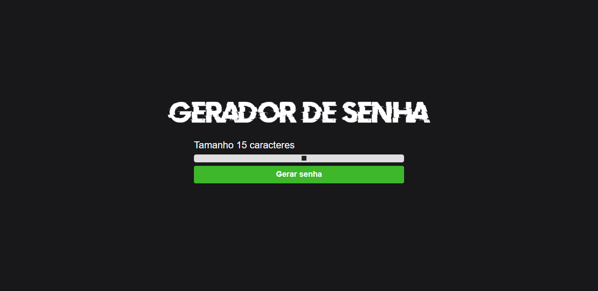

<h1 align="center"> Gerador de senhas 💻 </h1>

## Briefing 📄

Sem ideias para a senha daquela rede social nova? apenas escolha um tamanho e consiga uma novinha!

O link para o tutorial com mais detalhes: [Youtube](https://youtu.be/i6t2jaRxos4)

<h2 align="left"> Objetivos 📌 </h2>

- Melhorar skills em javascript

---

<h3 align="center"> showcase 📝 </h3>

<h3 align="center"> Tecnologias utilizadas 🤖 </h3>

> 

